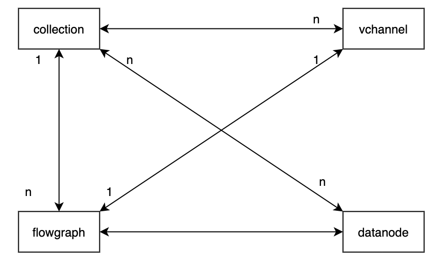
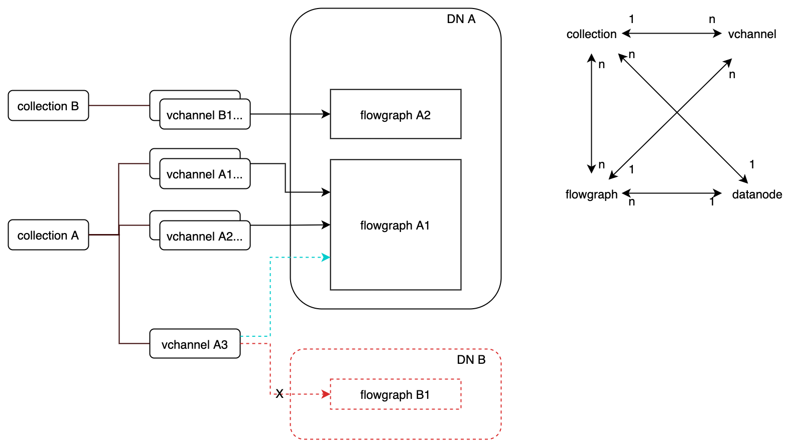

# DataNode Recovery Design

update: 5.21.2021, by [Goose](https://github.com/XuanYang-cn)

## Objectives

DataNode is stateless. It does whatever DataService tells, so recovery is not a difficult thing for datanode.
Once datanode subscribes certain vchannels, it starts working till crash. So the key to recovery is consuming
vchannels at the right position. What's processed no longer need to be processed again, what's not processed is
the key.

What's the line between processed or not for DataNode? Wether the data is flushed into persistent storage, which's
 the only job of DataNode. So recovering a DataNode needs the last positions of flushed data in every vchannels.
Luckily, this information will be told by DataService, DataNode only worries about updating positions after flushing.

There's more to fully recover a DataNode. DataNode replicates collection schema in memory to decode and encode
data. Once it recovers to an older position of insert channels, it needs the collection schema snapshots from
that exactly position. Luckily again, the snapshots will be provided via MasterService.

So DataNode needs to achieve the following 3 objectives.

### 1. Service Registration

DataNode registers itself to Etcd after grpc server started, in *INITIALIZING* state.

### 2. Service discovery

DataNode discovers DataService and MasterService, in *HEALTHY* state.

### 3. Recovery state

After stage 1&2, DataNode is healthy but IDLE. DataNode starts to work until the following happens.

- DataService info the vchannels and positions.

- DataNode replicates the snapshots of collection schema at the positions to which these vchannel belongs.

- DataNode initializes flowgraphs and subscribes to these vchannels

There're some problems I haven't thought of.

- What if DataService is unavaliable, by network failure, DataService crashing, etc.
- What if MasterService is unavaliable, by network failure, MasterService crashing, etc.
- What if MinIO is unavaliable, by network failure.

## TODO

### 1. DataNode no longer interacts with Etcd except service registering

#### **O1-1** DataService rather than DataNode saves binlog paths into Etcd
    
   

##### Auto-flush with manul-flush

Manul-flush means that the segment is sealed, and DataNode is told to flush by DataService. The completion of
manul-flush requires ddl and insert data both flushed, and a flush completed message will be published to
msgstream by DataService. In this case, not only do binlog paths need to be stored, but also msg-positions.

Auto-flush means that the segment isn't sealed, but the buffer of insert/ddl data in DataNode is full,
DataNode automatically flushs these data. Those flushed binlogs' paths are buffered in DataNode, waiting for the next
manul-flush and upload to DataServce together.

##### DataService RPC Design

```proto
rpc SaveBinlogPaths(SaveBinlogPathsRequest) returns (common.Status){}
message ID2PathList {
    int64 ID = 1;
    repeated string Paths = 2;
}

message SaveBinlogPathsRequest {
    common.MsgBase base = 1;
    int64 segmentID = 2;
    int64 collectionID = 3;
    ID2PathList field2BinlogPaths = 4;
    ID2PathList coll2TsBinlogPaths = 5;
    ID2PathList coll2DdlBinlogPaths = 6;
    repeated internal.MsgPosition start_positions = 7;
    repeated internal.MsgPosition end_positions = 8;
 }
```

##### DataService Etcd Binlog Meta Design

The same as DataNode

```proto
// key: ${prefix}/${segmentID}/${fieldID}/${idx}
message SegmentFieldBinlogMeta {
    int64  fieldID = 1;
    string binlog_path = 2;
}

// key: ${prefix}/${collectionID}/${idx}
message DDLBinlogMeta {
    string ddl_binlog_path = 1;
    string ts_binlog_path = 2;
}
```
    
#### **O1-2** DataNode registers itself to Etcd when started
    
### 2. DataNode gets start and end MsgPositions of all channels, and report to DataService after flushing

   **O2-1**. Set start and end positions while publishing ddl messages. 0.5 Day

   **O2-2**. [after **O4-1**] Get message positions in flowgraph and pass through nodes, report to DataService along with binlog paths. 1 Day

   **O2-3**. [with **O1-1**] DataNode is no longer aware of whether if segment flushed, so SegmentFlushed messages should be sent by DataService. 1 Day

### 3. DataNode recovery

   **O3-1**. Flowgraph is initialized after DataService called WatchDmChannels, flowgraph is healthy if MasterService is available. 2 Day

### 4. DataNode with collection with flowgraph with vchannel designs

#### The winner
  

  

**O4-1.** DataNode scales flowgraph 2 Day

Change `WatchDmChannelsRequest` proto.

``` proto
message PositionPair {
  internal.MsgPosition start_position = 1;
  internal.MsgPosition end_position = 2;
}

message VchannelPair {
  int64 collectionID = 1;
  string dml_vchannel_name = 2;
  string ddl_vchannel_name = 3;
  PositionPair ddl_position = 4;
  PositionPair dml_position = 5;
}

message WatchDmChannelsRequest {
  common.MsgBase base = 1;
  repeated VchannelPair vchannels = 2;
}
```

DataNode consists of multiple DataSyncService, each service controls one flowgraph.

```go
// DataNode
type DataNode struct {
    ...
    vchan2Sync map[string]*dataSyncService
    vchan2FlushCh map[string]chan<- *flushMsg
    ...
    replica Replica // TODO remove
}

// DataSyncService
type dataSyncService struct {
	ctx          context.Context
	fg           *flowgraph.TimeTickedFlowGraph
	flushChan    <-chan *flushMsg
	replica      Replica
	idAllocator  allocatorInterface
	msFactory    msgstream.Factory
	collectionID UniqueID
	segmentIDs   []UniqueID // getSegmentIDs() of Replica
}
```

DataNode Init -> Resigter to Etcd -> Discovery data service -> Discover master service -> IDLE

WatchDmChannels -> new dataSyncService -> HEALTH

```proto
message WatchDmChannelsRequest {
  common.MsgBase base = 1;
  repeated VchannelPair vchannels = 2;
}
```
`WatchDmChannels:`

1. If `DataNode.vchan2Sync` is empty, DataNode is in IDLE, `WatchDmChannels` will create new dataSyncService for every unique vchannel, then DataNode is in HEALTH.
2. If vchannel name of `VchannelPair` is not in `DataNode.vchan2Sync`, create a new dataSyncService.
3. If vchannel name of `VchannelPair` is in `DataNode.vchan2Sync`, ignore.

`newDataSyncService:`

```go
func newDataSyncService(ctx context.Context, flushChan <-chan *flushMsg, replica Replica,
    alloc allocatorInterface, factory msgstream.Factory, vchanPair *datapb.VchannelPair) *dataSyncService

```

#### The boring design

• If collection:flowgraph = 1 : 1, datanode must have ability to scale flowgraph.


•** [Winner]** If collection:flowgraph = 1 : n, flowgraph:vchannel = 1:1


• If collection:flowgraph = n : 1, in the blue cases, datanode must have ability to scale flowgraph. In the brown cases, flowgraph must be able to scale channels.


• If collection:flowgraph = n : n  , load balancing on vchannels.




