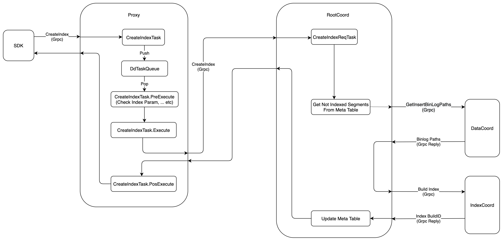
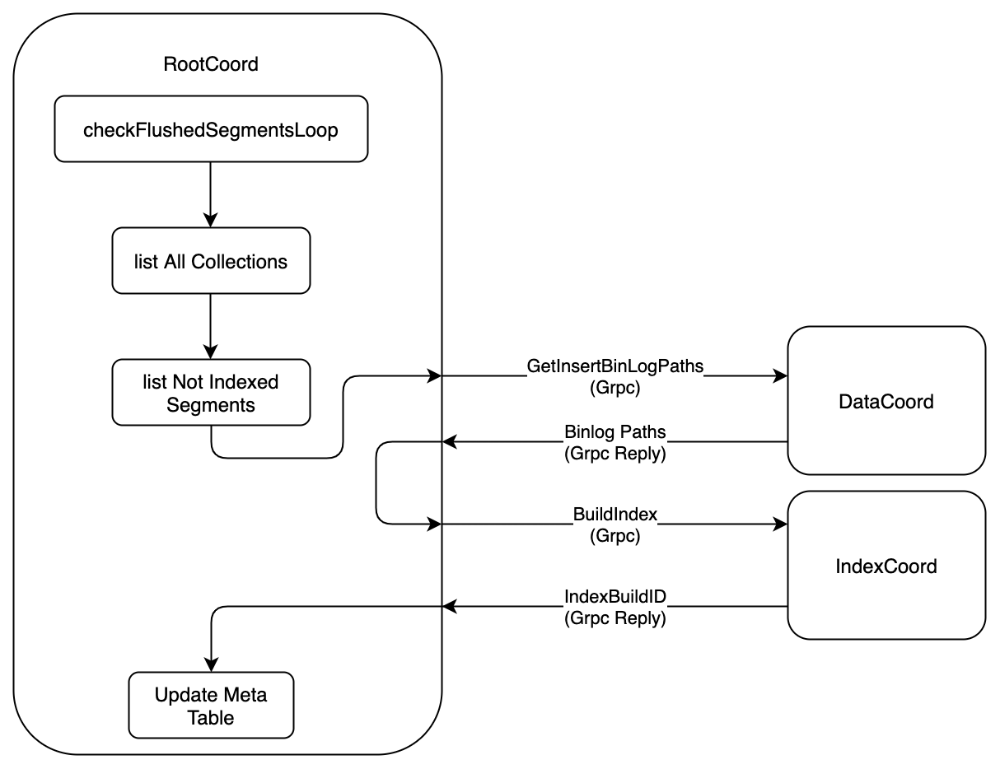

# Create Index
`Index system` is the core part of `Milvus`, which is used to speed up the searches, this document indroduces which components are involved in `Create Index`,and what do these components do?

The execution flow of `Create Index` is shown in the following figure:



1. Firstly, `SDK` starts a `CreateIndex` request to `Proxy` via `Grpc`, the `proto` is defined as follows:
```proto
service MilvusService {
    ...

    rpc CreateIndex(CreateIndexRequest) returns (common.Status) {}

    ...
}

message CreateIndexRequest {
  common.MsgBase base = 1; // must
  string db_name = 2;
  string collection_name = 3; // must
  string field_name = 4; // must
  repeated common.KeyValuePair extra_params = 5; // must
}
```

2. When received the `CreateIndex` request, the `Proxy` would wrap this request into `CreateIndexTask`, and pushs this task into `DdTaskQueue` queue. After that, `Proxy` would call method of `WatiToFinish` to wait until the task finished.
 
```go
type task interface {
	TraceCtx() context.Context
	ID() UniqueID       // return ReqID
	SetID(uid UniqueID) // set ReqID
	Name() string
	Type() commonpb.MsgType
	BeginTs() Timestamp
	EndTs() Timestamp
	SetTs(ts Timestamp)
	OnEnqueue() error
	PreExecute(ctx context.Context) error
	Execute(ctx context.Context) error
	PostExecute(ctx context.Context) error
	WaitToFinish() error
	Notify(err error)
}

type createIndexTask struct {
	Condition
	*milvuspb.CreateIndexRequest
	ctx       context.Context
	rootCoord types.RootCoord
	result    *commonpb.Status
}
```

3. There is a background service in `Proxy`, this service would get the `CreateIndexTask` from `DdTaskQueue`, and executes it in three phases.
    - `PreExecute`, do some static checking at this phase, such as check if the index param is legal, etc. 
    - `Execute`, at this phase, `Proxy` would send `CreateIndex` request to `RootCoord` via `Grpc`,and wait the reponse, the `proto` is defined as follow:
    ```proto
        service RootCoord {
          ...

           rpc CreateIndex(milvus.CreateIndexRequest) returns (common.Status) {}

          ...
        }
    ```
    - `PostExecute`, `CreateIndexTask` does nothing at this phase, and return directly.

4. `RootCoord` would wraps the `CreateIndex` request into `CreateIndexReqTask`, and then call function `executeTask`. `executeTask` would return until the `context` is done or `CreateIndexReqTask.Execute` returned.
```go
type reqTask interface {
	Ctx() context.Context
	Type() commonpb.MsgType
	Execute(ctx context.Context) error
	Core() *Core
}

type CreateIndexReqTask struct {
	baseReqTask
	Req *milvuspb.CreateIndexRequest
}
```

5. According to the index type and index parameters, `RootCoord` lists all the `Segments` that need to be indexed on this `Collection`. `RootCoord` would only check those `Segments` which have been flushed at this stage. We will describe how to deal with those newly add segments and growing segments later. 

6. For each `Segment`, `RootCoord` would start a `Grpc` request to `DataCoord` to get `Binlog` paths of that `Segment`, the `proto` is defined as following
```proto
service DataCoord {
    ...
    
    rpc GetInsertBinlogPaths(GetInsertBinlogPathsRequest) returns (GetInsertBinlogPathsResponse) {}
    
    ...

}

message GetInsertBinlogPathsRequest {
  common.MsgBase base = 1;
  int64 segmentID = 2;
}

message GetInsertBinlogPathsResponse {
  repeated int64 fieldIDs = 1;
  repeated internal.StringList paths = 2;
  common.Status status = 3;
}

```
7. After getting the `Segment`'s `Binlog` paths, `RootCoord` would send a `Grpc` request to `IndexCoord`, ask `IndexCoord` to build index on this `Segment`, the `proto` is defined as follow: 
```proto
service IndexCoord {
  ...

  rpc BuildIndex(BuildIndexRequest) returns (BuildIndexResponse){}

  ...
}

message BuildIndexRequest {
  int64 indexBuildID = 1;
  string index_name = 2;
  int64 indexID = 3;
  repeated string data_paths = 5;
  repeated common.KeyValuePair type_params = 6;
  repeated common.KeyValuePair index_params = 7;
}

message BuildIndexResponse {
  common.Status status = 1;
  int64 indexBuildID = 2;
}

```

8. The execution flow of `BuildIndex` on `IndexCoord` is shown in the flowwing figure


9. `IndexCoord` would wrap the `BuildIndex` request into `IndexAddTask`, then alloc a global unique ID as `IndexBuildID`, and write this `Segment`'s `index mate` into `IndexCoord`'s `metaTable`. When finish these operation, `IndexCoord` would send response to `RootCoord`, the response includes the `IndexBuildID`. 

10.  When `RootCoood` receives the `BuildIndexResponse`, it would extract the `IndexBuildID` from the response, update `RootCoord`'s `metaTable`, then send responses to `Proxy`. 

11.  There is a backgroud service, `assignTaskLoop`, in `IndexCoord`. `assignTaskLoop` would call `GetUnassignedTask` periodically, the default interval is 3s. `GetUnassignedTask` would list these segments whos `index meta` has been updated, but index has not been created yet. 

12.  The previous step has listed the segments whose index has not been created, for each those segments, `IndexCoord` would call `PeekClient` to get an available `IndexNode`,   and send `CreateIndex` request to this `IndexNode`. The `proto` is defined as follow. 
```proto
service IndexNode {
  ...

  rpc CreateIndex(CreateIndexRequest) returns (common.Status){}

  ...
}

message CreateIndexRequest {
  int64 indexBuildID = 1;
  string index_name = 2;
  int64 indexID = 3;
  int64 version = 4;
  string meta_path = 5;
  repeated string data_paths = 6;
  repeated common.KeyValuePair type_params = 7;
  repeated common.KeyValuePair index_params = 8;
}
```

13. When receive `CreateIndex` request, `IndexNode` would wrap this request into `IndexBuildTask`, and push this task into `IndexBuildQueue`, then send response to `IndexCoord`  

14. There is a background service, `indexBuildLoop`, in the `IndexNode`. `indexBuildLoop` would call `scheduleIndexBuildTask` to get a `IndexBuildTask` from `IndexBuildQueue`, and then start another `goroutine` to build index and update meta.

*Node*: `InexNode` will not notify the `QueryCoord` to load the index file, if an user wants to speed up seach by these index files, he should call `ReleaseCollection` firstly, then call `LoadCollection` to load these index files.

15.  As mentioned earlier, `RootCoord` would only search on these flushed segments on `CreateIndex` request, the following figure show how to deal with the newly add segments.  


16. When a segment has been flushed, `DataCoord` would notify `RootCoord` via `SegmentFlushCompleted`, the `proto` is defined as follow:   
```proto
service RootCoord {
  ...

  rpc SegmentFlushCompleted(data.SegmentFlushCompletedMsg) returns (common.Status) {}

  ...
}

message SegmentFlushCompletedMsg {
  common.MsgBase base = 1;
  SegmentInfo segment = 2;
}

message SegmentInfo {
  int64 ID = 1;
  int64 collectionID = 2;
  int64 partitionID = 3;
  string insert_channel = 4;
  int64 num_of_rows = 5;
  common.SegmentState state = 6;
  int64 max_row_num = 7;
  uint64 last_expire_time = 8;
  internal.MsgPosition start_position = 9;
  internal.MsgPosition dml_position = 10;
  repeated FieldBinlog binlogs = 11;
}

```
17. If users has called `CreateIndex` on this `Collection`, then when `RootCoord` receives `SegmentFlushCompleted` request, it would extract the `SegmentID` from the request, and send a `GetInsertBinlogPaths` request to `DataCoord` to get the `Binlog` paths, finally `RootCoord` would send a `BuildIndex` request to `IndexCoord` to notify `IndexCoord` to build index on this segment.  

18. The `Grpc` call of `SegmentFlushCompleted` might failed dure to network problem or some others, so how to create index if the `Grpc` failed ? The follwing figure show the solution.



19. There is a backgroud service, `checkFlushedSegmentLoop`, in `RootCoord`. `checkFlushedSegmentLoop` would periodically check whether there is a segment that needs to be created index but has not been created, the default interval is `10 minutes`, and call `DataCoord` and `IndexCoord`'s service to create index on these segments.

20. In `Milvus 2.0`, `Create Index` is an asynchronous operation, so the `SDK` need to send `GetIndexStates` request to `IndexCoord` periodically to check if the index has been created, the `proto` is defined as follow.
```proto
service IndexCoord {
  ...

  rpc GetIndexStates(GetIndexStatesRequest) returns (GetIndexStatesResponse) {}

  ...
}

message GetIndexStatesRequest {
  repeated int64 indexBuildIDs = 1;
}

message GetIndexStatesResponse {
  common.Status status = 1;
  repeated IndexInfo states = 2;
}

message IndexInfo {
  common.IndexState state = 1;
  int64 indexBuildID = 2;
  int64 indexID = 3;
  string index_name = 4;
  string reason = 5;
}

enum IndexState {
    IndexStateNone = 0;
    Unissued = 1;
    InProgress = 2;
    Finished = 3;
    Failed = 4;
}
```
